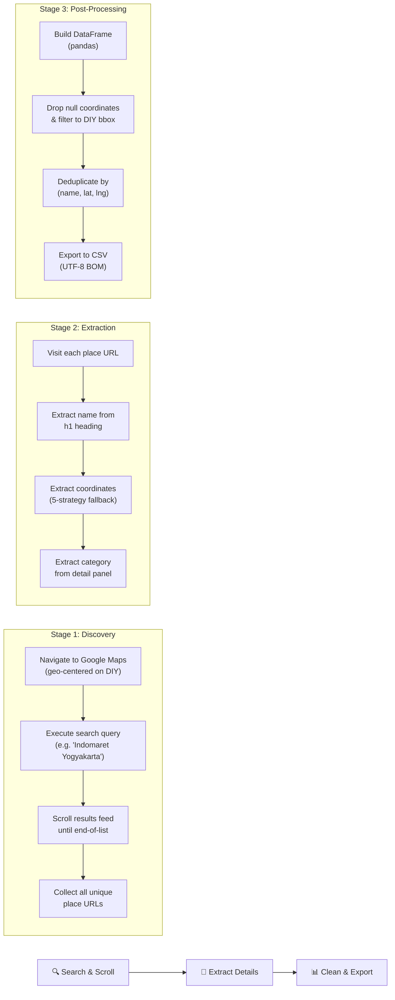

<p align="center">
  
</p>

<h1 align="center">💰 BI Cash-Handling Distribution Node Mapper</h1>

<p align="center">
  <strong>Automated geospatial extraction of potential cash handling & distribution points across the Special Region of Yogyakarta (DIY), Indonesia.</strong>
</p>

<p align="center">
  
  
  
  
  
</p>

---

## 📋 Table of Contents

- [Overview](#-overview)
- [Motivation](#-motivation)
- [Architecture](#-architecture)
- [Data Schema](#-data-schema)
- [Scraped Results Summary](#-scraped-results-summary)
- [Getting Started](#-getting-started)
- [Configuration](#-configuration)
- [How It Works](#-how-it-works)
- [Output](#-output)
- [Project Structure](#-project-structure)
- [Limitations & Disclaimer](#-limitations--disclaimer)

---

## 🔍 Overview

This project provides an **automated web scraping pipeline** that extracts location data from **Google Maps** for businesses that can serve as proxy nodes in a cash handling and distribution network. Using browser automation with anti-detection measures, the scraper collects precise geospatial data — name, coordinates, and business category — for **8 target business types** across the DIY province.

The extracted dataset (`diy_cash_nodes.csv`) is ready for downstream spatial analysis, clustering, route optimization, and geographic visualization.

---

## 💡 Motivation

Bank Indonesia's cash distribution network relies on identifying strategically located proxy points that have:

- ✅ Established **point-of-sale infrastructure**
- ✅ Secure, **commercially operated** environments
- ✅ High **geographic density** in both urban and semi-urban areas
- ✅ Extended **operating hours** for public accessibility

The following business types were selected as candidates:

| Business | Rationale |
|:---------|:----------|
| **Kantor Pos** | National postal network with existing financial service capabilities |
| **Pegadaian** | State-owned pawn shops with cash-heavy transactions and vault infrastructure |
| **Indomaret** | Largest minimarket chain; POS systems, digital payment integration |
| **Alfamart** | Second-largest minimarket chain; comparable infrastructure to Indomaret |
| **Alfamidi** | Mid-size supermarket variant with broader product range and cash flow |
| **Lawson** | Japanese convenience chain with modern POS and urban penetration |
| **Circle K** | 24-hour international chain with secure environments and high foot traffic |
| **Superindo** | Supermarket chain with high-value transactions and established supply chains |

---

## 🏗 Architecture

The scraping pipeline follows a three-stage architecture:



### Multi-Strategy Coordinate Extraction

Google Maps does not always expose coordinates in the URL immediately. The scraper employs a **5-level fallback chain** to guarantee extraction:

```
Strategy 1 → Parse @lat,lng from current page URL
    ↓ (fail)
Strategy 2 → Poll the URL for up to 3 seconds (async update)
    ↓ (fail)
Strategy 3 → Parse !3d / !4d data parameters from the original href
    ↓ (fail)
Strategy 4 → Regex scan on raw page HTML source for DIY-range coordinates
    ↓ (fail)
Strategy 5 → JavaScript evaluation on page text content & meta tags
```

> This cascade achieved a **100% coordinate extraction rate** (0 nulls in 412 raw records) during the production run.

---

## 📐 Data Schema

The output CSV (`diy_cash_nodes.csv`) contains the following columns:

| Column | Type | Description | Example |
|:-------|:-----|:------------|:--------|
| `name` | `string` | Official business/branch name as displayed on Google Maps | `Indomaret Malioboro` |
| `latitude` | `float` | Latitudinal coordinate (WGS 84) | `-7.7913762` |
| `longitude` | `float` | Longitudinal coordinate (WGS 84) | `110.3658789` |
| `category` | `string` | Business type as categorized by Google Maps (in Indonesian) | `Minimarket` |
| `search_query` | `string` | The original search query that returned this result | `Indomaret` |

### Category Labels (Indonesian)

Since the scraper runs with `hl=id` (Indonesian locale), the category labels are returned in Indonesian:

| Indonesian Category | English Equivalent |
|:-------------------|:------------------|
| Minimarket | Convenience Store |
| Toko Swalayan | Supermarket |
| Toko Gadai | Pawn Shop |
| Kantor Pos | Post Office |
| Toko bahan makanan | Grocery Store |
| Pusat Perbelanjaan | Shopping Center |
| Layanan Surat | Mail Service |
| Restoran | Restaurant |

---

## 📊 Scraped Results Summary

**Total: 409 unique locations** extracted and validated.

| Search Query | Locations | Primary Category |
|:-------------|:---------:|:-----------------|
| 🏪 Alfamart | **90** | Minimarket |
| 📮 Kantor Pos | **88** | Kantor Pos |
| 🏪 Indomaret | **87** | Minimarket |
| 🔵 Circle K | **44** | Minimarket |
| 🏬 Alfamidi | **35** | Toko Swalayan / Minimarket |
| 💍 Pegadaian | **33** | Toko Gadai |
| 🛒 Superindo | **17** | Toko Swalayan |
| 🏪 Lawson | **15** | Minimarket / Restoran |

### Geographic Coverage

| Metric | Value |
|:-------|:------|
| Latitude range | `-7.8609` to `-7.6868` |
| Longitude range | `110.2662` to `110.4641` |
| Bounding box | Fully within DIY province |
| Null values | **0** across all columns |
| Duplicates removed | 3 |

---

## 🚀 Getting Started

### Prerequisites

- **Python 3.11+**
- **Windows / macOS / Linux** with a display (headed browser mode)
- A stable internet connection

### Installation

```bash
# 1. Clone the repository
git clone https://github.com/MarcoAlandAdinanda/BI_Cash-Handling-Project.git
cd BI_Cash-Handling-Project

# 2. Install Python dependencies
pip install -r requirements.txt

# 3. Install Playwright's Chromium browser
playwright install chromium
```

### Run the Scraper

```bash
python scrape_gmaps.py
```

> ⏱ **Expected runtime:** ~45 minutes for all 8 queries. A visible Chromium browser window will open and operate autonomously.

---

## ⚙ Configuration

All tunable parameters are defined as constants at the top of `scrape_gmaps.py`:

### Search Parameters

| Constant | Default | Description |
|:---------|:--------|:------------|
| `SEARCH_QUERIES` | 8 queries | List of business types to search |
| `DIY_CENTER_LAT` | `-7.797` | Map center latitude (Yogyakarta) |
| `DIY_CENTER_LNG` | `110.361` | Map center longitude |
| `DIY_ZOOM` | `11` | Google Maps zoom level |

### Bounding Box Filter

| Constant | Default | Description |
|:---------|:--------|:------------|
| `DIY_LAT_MIN` | `-8.00` | Southern boundary |
| `DIY_LAT_MAX` | `-7.55` | Northern boundary |
| `DIY_LNG_MIN` | `110.05` | Western boundary |
| `DIY_LNG_MAX` | `110.75` | Eastern boundary |

### Anti-Bot Timing

| Constant | Default | Description |
|:---------|:--------|:------------|
| `DELAY_BETWEEN_CLICKS` | `(1.5, 3.5)` sec | Random delay between place visits |
| `DELAY_BETWEEN_QUERIES` | `(4.0, 8.0)` sec | Random delay between search queries |
| `DELAY_SCROLL_PAUSE` | `(1.0, 2.5)` sec | Random delay between scroll actions |
| `MAX_SCROLL_ATTEMPTS` | `40` | Max scroll iterations per query |

### Output

| Constant | Default | Description |
|:---------|:--------|:------------|
| `OUTPUT_CSV` | `diy_cash_nodes.csv` | Output filename |

---

## 🔧 How It Works

### 1. Browser Initialization

The scraper launches a **headed Chromium** browser via Playwright with stealth patches applied to mask automation signals:

```python
async with Stealth().use_async(async_playwright()) as p:
    browser = await p.chromium.launch(
        headless=False,
        args=["--disable-blink-features=AutomationControlled"],
    )
    context = await browser.new_context(
        locale="id-ID",
        timezone_id="Asia/Jakarta",
        geolocation={"latitude": -7.797, "longitude": 110.361},
    )
```

**Anti-detection features include:**
- `playwright-stealth` patches (`navigator.webdriver`, plugins, etc.)
- Indonesian locale and Jakarta timezone
- DIY geolocation spoofing
- Realistic viewport (1366×768)
- Indonesian `Accept-Language` headers

### 2. Search & Infinite Scroll

For each query, the scraper:

1. Navigates to a pre-constructed URL centered on Yogyakarta
2. Waits for the results `<div role="feed">` to appear
3. Incrementally scrolls the feed container, counting results after each scroll
4. Stops when: end-of-list marker is detected **OR** no new results after 5 consecutive scrolls

```python
# Scroll the feed container
await feed.evaluate("el => el.scrollTop = el.scrollHeight")
```

### 3. Per-Location Data Extraction

For each unique place URL collected:

- **Name** → Extracted from `h1.DUwDvf` or `[role="main"] h1`
- **Coordinates** → 5-strategy fallback cascade (see [Architecture](#-architecture))
- **Category** → Extracted from `button[jsaction*="category"]`, `span.DkEaL`, or JS evaluation

### 4. Data Cleaning Pipeline

```python
df.dropna(subset=["latitude", "longitude"])          # Remove null coordinates
df = df[(df.latitude >= LAT_MIN) & ...]              # Filter to DIY bbox
df.drop_duplicates(subset=["name", "lat", "lng"])     # Deduplicate
df.to_csv("diy_cash_nodes.csv", encoding="utf-8-sig") # Export (Excel-friendly)
```

---

## 📁 Output

### CSV Preview

```
name,latitude,longitude,category,search_query
Indomaret Malioboro,-7.7913762,110.3658789,Minimarket,Indomaret
Pegadaian Palagan,-7.7469621,110.3729463,Toko Gadai,Pegadaian
Circle K Babarsari,-7.7756168,110.4156899,Minimarket,Circle K
Kantor Pos Besar Yogyakarta,-7.8016265,110.365139,Kantor Pos,Kantor Pos
Superindo Kaliurang,-7.7527323,110.3849964,Toko Swalayan,Superindo
```

### Using the Data

```python
import pandas as pd

df = pd.read_csv("diy_cash_nodes.csv")

# Filter only convenience stores
stores = df[df["category"] == "Minimarket"]

# Get all Pegadaian locations
pegadaian = df[df["search_query"] == "Pegadaian"]

# Geographic center of all nodes
center_lat = df["latitude"].mean()   # ≈ -7.787
center_lng = df["longitude"].mean()  # ≈ 110.377
```

---

## 📂 Project Structure

```
BI_Cash-Handling-Project/
│
├── scrape_gmaps.py        # Main scraper script (Playwright + Stealth)
├── requirements.txt       # Python dependencies
├── diy_cash_nodes.csv     # Output: 409 extracted location records
├── assets/
│   └── banner.png         # Repository banner image
└── README.md              # This documentation
```

### `scrape_gmaps.py` — Module Breakdown

| Section | Lines | Description |
|:--------|:-----:|:------------|
| Configuration | 31–69 | Constants for queries, geo-bounds, delays, output |
| Helper Functions | 80–143 | `human_delay()`, `extract_coords_from_url()`, `build_search_url()` |
| Coordinate Extraction | 146–209 | `extract_coordinates()` — 5-strategy cascade |
| Scroll Logic | 212–267 | `scroll_results_feed()` — infinite scroll handler |
| Query Processor | 270–426 | `scrape_query()` — orchestrates search → scroll → extract |
| Main Orchestrator | 429–553 | `main()` — runs all queries, cleans data, exports CSV |

---

## ⚠ Limitations & Disclaimer

### Technical Limitations

- **Google Maps DOM volatility:** CSS selectors (e.g., `h1.DUwDvf`, `span.DkEaL`) may break if Google updates their front-end. The script includes fallback selectors for resilience.
- **Result cap:** Google Maps search typically returns a maximum of ~100 results per query. Locations beyond this threshold will not be captured.
- **Category accuracy:** Google Maps category labels are community-contributed and may not always reflect the actual business type (e.g., a Lawson may be categorized as "Restoran" instead of "Minimarket").
- **Headed mode required:** The browser must run in visible/headed mode. Headless mode triggers aggressive anti-bot detection on Google Maps.

### Legal Disclaimer

> ⚠️ **This tool is intended for academic and research purposes only.** Automated scraping of Google Maps may violate Google's Terms of Service. For production or commercial use, consider the [Google Places API](https://developers.google.com/maps/documentation/places/web-service/overview), which provides structured, reliable data through official channels.

---

<p align="center">
  <sub>Built for <strong>Bank Indonesia Cash Handling Research</strong> — Special Region of Yogyakarta, 2026</sub>
</p>
